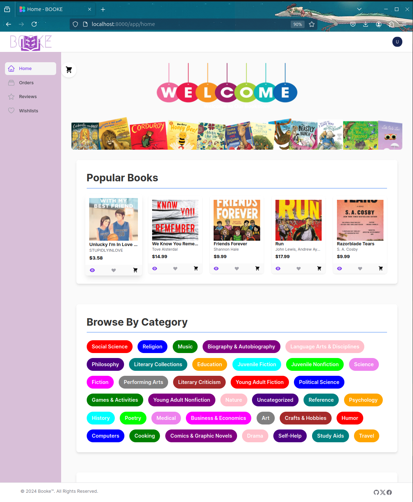
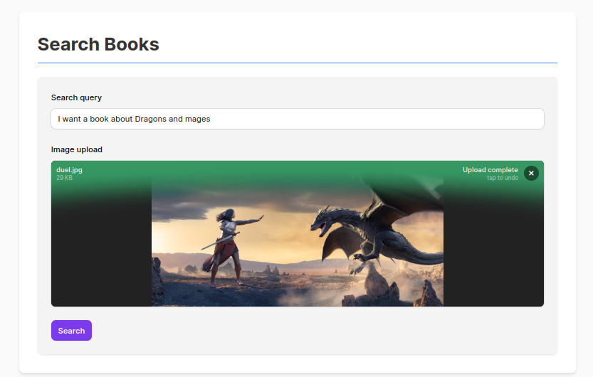
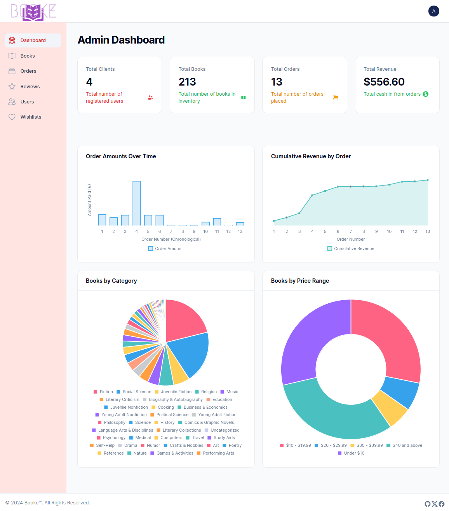

# Booke - AI-Powered E-Bookstore


Booke is an advanced e-bookstore application built with Laravel and FilamentPHP. It leverages AI technologies to provide personalized book recommendations and image-based book searches.

## Features

-   User authentication with multiple roles (Admin, Manager, User)
-   Book catalog powered by Google Books API
-   AI-based personalized book recommendations using PHP-ML
-   Image-based book search using Google Vision AI
-   User reviews and ratings for purchased books
-   Wishlist management
-   Order processing and management
-   Admin panel for user, book, and order management

## Screenshots

### Home Page



### Image Search



### Admin Dashboard



## Prerequisites

-   PHP 8.1 or higher
-   Composer
-   MySQL
-   Node.js and NPM

## Installation

1. **Clone the repository:**

    ```bash
    git clone https://github.com/yourusername/booke.git
    cd booke
    ```

2. **Install PHP dependencies:**

    ```bash
    composer install
    ```

3. **Install NPM dependencies:**

    ```bash
    npm install
    ```

4. **Create a copy of the `.env.example` file and rename it to `.env`:**

    ```bash
    cp .env.example .env
    ```

5. **Generate an application key:**

    ```bash
    php artisan key:generate
    ```

6. **Configure your database in the `.env` file:**

    ```env
    DB_CONNECTION=mysql
    DB_HOST=127.0.0.1
    DB_PORT=3306
    DB_DATABASE=booke
    DB_USERNAME=your_username
    DB_PASSWORD=your_password
    ```

7. **Set up Google Books API and Google Vision AI:**

    - Add your Google Books API key to the `.env` file:
        ```env
        GOOGLE_BOOKS_API_KEY=your_api_key
        ```
    - Set the path to your Google Application Credentials JSON file:
        ```env
        GOOGLE_APPLICATION_CREDENTIALS=/path/to/your/credentials.json
        ```

8. **Run database migrations:**

    ```bash
    php artisan migrate
    ```

9. **Seed the database with initial data:**

    ```bash
    php artisan db:seed
    ```

10. **Compile assets:**

    ```bash
    npm run dev
    ```

11. **Start the development server:**
    ```bash
    php artisan serve
    ```

Visit `http://localhost:8000` in your browser to access the application.

## Usage

-   Register as a new user or log in with the following demo accounts:

    -   Admin: `admin@booke.com` / `password`
    -   Manager: `manager@booke.com` / `password`
    -   User: `user@booke.com` / `password`

-   Explore the book catalog, add books to your wishlist, and make purchases
-   Use the image upload feature to search for books based on cover images
-   Leave reviews for purchased books
-   Access the admin panel when you login with admin or manager roles

## Acknowledgments

-   [Laravel](https://laravel.com)
-   [FilamentPHP](https://filamentphp.com)
-   [Google Books API](https://developers.google.com/books)
-   [Google Cloud Vision API](https://cloud.google.com/vision)
-   [PHP-ML](https://php-ml.readthedocs.io/)
